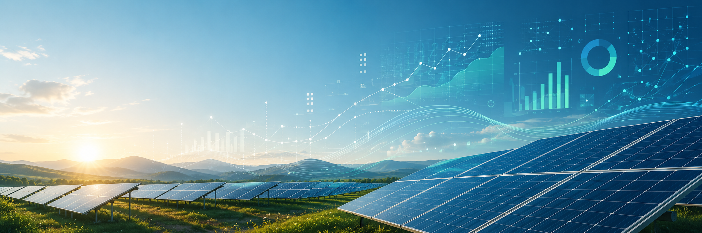

# Solar Portfolio Performance Control



## Overview

This project automated the collection, consolidation, and analysis of solar generation data from multiple monitoring platforms.

The original process was manual, fragmented, and dependent on several external systems that did not communicate with each other. Each inverter manufacturer or monitoring provider had its own platform, interface, and data structure, making daily performance tracking operationally inefficient and difficult to scale.

The solution was developed in Python and centralized generation data from approximately **50 solar assets** across **5 to 6 monitoring platforms**, including iSolarCloud, SolisCloud, SolarView, Huawei, and others.

What began as a simple operational automation later became a relevant data source for internal reports, the Integrated Operations Center, and contractual performance tests with EPC providers.

---

## Business Context

The company monitored several solar assets distributed across different inverter manufacturers and monitoring platforms.

Before this project, generation data had to be collected manually from each platform. This created a recurring operational bottleneck and made it harder to compare assets, identify deviations, and build consistent performance reports.

The initial goal was pragmatic: create a centralized base to support daily performance monitoring.

However, after the automation proved reliable, the consolidated data started being used in broader operational and contractual processes.

---

## Problem

The main challenges were:

* Generation data was spread across multiple platforms;
* Systems had different interfaces and data structures;
* Data collection was mostly manual;
* Daily monitoring required repetitive operational effort;
* Performance analysis lacked a centralized and standardized data source.

This limited the ability to monitor asset performance efficiently and created friction for reporting and contractual validation.

---

## Solution

I started studying Python and developed an automation workflow using:

* `pandas` for data treatment and consolidation;
* `gspread` for integration with Google Sheets;
* `selenium` for web automation and data extraction from monitoring platforms.

The workflow followed this general structure:

```text
Monitoring platforms
        ↓
Automated data collection
        ↓
Data cleaning and standardization
        ↓
Centralized generation database
        ↓
Reports, operational monitoring and performance tests
```

The automation collected generation data from different platforms, standardized the information, and concentrated it in a single base that could be used by different teams and processes.

---

## Platforms Integrated

The automation covered approximately 5 to 6 monitoring platforms, including:

* iSolarCloud
* SolisCloud
* SolarView
* Huawei
* Other inverter and monitoring systems

In total, the consolidated base covered around **50 solar assets**.

---

## Impact

The project delivered value beyond its initial scope.

The original objective was to centralize data for daily performance tracking. Over time, the same automation became useful for:

* Reducing manual data collection;
* Improving consistency in generation data;
* Supporting daily asset performance monitoring;
* Creating inputs for internal reports;
* Feeding operational views used by the Integrated Operations Center;
* Supporting performance tests used in contractual milestones with EPC providers.

One of the most relevant outcomes was that the automated data was later used in performance tests executed at the end of EPC contracts, supporting the validation of one of the contractual milestones.


---

## Key Skills

* Process automation
* Data collection from multiple sources
* Data cleaning and standardization
* Python for business operations
* Operational analytics
* Solar asset performance monitoring
* Practical use of data in contractual and operational workflows

---

## Technical Notes

This was not designed as a complex software engineering project. The goal was to solve a concrete operational problem with a simple, useful, and maintainable automation.

The solution prioritized:

* Practicality;
* Fast implementation;
* Operational usability;
* Low infrastructure complexity;
* Easy access to consolidated data by business users.

Because the project was developed in a corporate context, this repository does not include real credentials, real asset names, sensitive operational data, or proprietary business information.

The structure shown here is a simplified representation of the logic, business problem, and impact of the original project.
