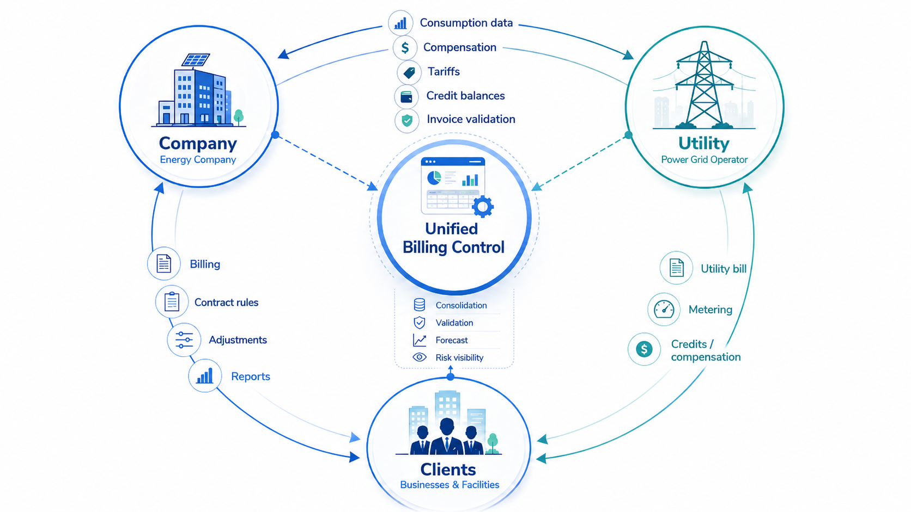
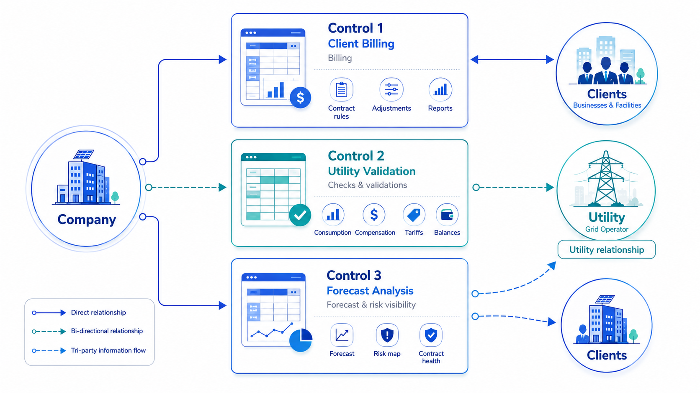
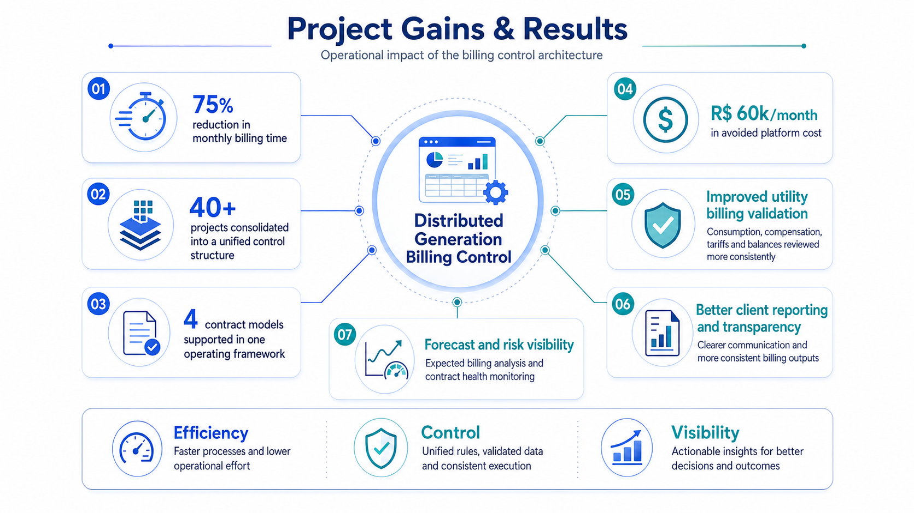

# Distributed Generation Billing Control

## Overview

This project documents the restructuring of a billing control process for a distributed generation solar portfolio composed of more than 40 projects and multiple large corporate clients.

The original process was highly fragmented: each project was billed through an individual spreadsheet, contract rules varied across the portfolio, and the billing team depended on manual checks across several files to validate consumption, energy compensation, tariffs, credits, and contractual adjustments.

The challenge was not simply to improve a spreadsheet. It was to bring structure to a billing operation that had become operationally fragile, commercially sensitive, and difficult to scale.

## Business Context

At the end of 2022, the team coordinator left the company, and I was appointed by the COO to temporarily lead a lean billing and asset management team of around 5 to 6 people while the company searched for a new manager.

Until that point, my responsibilities were mostly related to asset performance. In a short period of time, my scope shifted significantly toward billing operations, account management, contract interpretation, and client-facing problem solving.

At the same time, the company was facing pressure from two major clients.

The largest client in the portfolio, with monthly billing above R$ 300k, started strongly questioning the contract structure. The contract had a relevant gap: certain plant-related demand costs had not been fully anticipated in the original financial modeling, and those costs were becoming material for the client. This triggered a sensitive negotiation process.

In parallel, another large client started questioning the contractual calculations used for billing adjustments. In practical terms, I had to quickly understand and operationalize different contract models across more than 40 projects while keeping the monthly billing process running.

## Initial Problem

The billing process had several structural issues:

* Each project had its own billing spreadsheet.
* More than 40 separate files had to be checked every month.
* Contractual rules were not centralized.
* Billing calculations depended heavily on manual validation.
* Utility invoices frequently introduced inconsistencies related to consumption, compensation, tariffs, credits, and balance movements.
* Internal controls were fragmented.
* The team was too lean to manually track every invoice and beneficiary-level inconsistency with the required level of reliability.
* Processing errors created recurring friction with clients.

The portfolio was based on distributed generation contracts where billing was linked to energy injection and compensation dynamics. This created an additional challenge: even when solar plants were structured to serve specific clients, energy compensation did not always follow generation in a clean or predictable way.

The utility companies were an external source of complexity, but before trying to solve that layer directly, I focused on what could be improved internally: the structure, visibility, and consistency of the billing control process.

## Objective

The objective was to create a unified operational control architecture capable of supporting the full billing cycle across the portfolio.

The solution needed to:

* Consolidate project-level billing into a structured control environment.
* Apply different contractual rules consistently.
* Validate utility billing information before it affected client-facing calculations.
* Reduce manual effort during the monthly billing cycle.
* Improve visibility over expected and actual billing values.
* Anticipate billing results based on operational and contractual assumptions.
* Reduce dependency on external credit-control platforms.
* Improve the quality of client-facing reports.
* Create a more reliable source of truth for the billing team.

Because the team was not technically oriented toward Python or SQL, the solution was intentionally designed in Google Sheets. The priority was not technical sophistication. The priority was adoption, usability, and operational impact.

## Solution Architecture

The solution was designed as a three-layer control architecture.

### 1. Client Contract Billing Control

The first layer concentrated the billing logic related to client contracts.

This control was responsible for translating different commercial and contractual rules into a standardized operational model. It supported multiple contract structures and enabled the team to calculate monthly billing values without relying on dozens of disconnected project-level files.

This layer included:

* Project-level billing consolidation.
* Contract-specific calculation rules.
* Monthly client billing logic.
* Adjustment calculations.
* Standardized billing outputs.
* A common structure for reviewing contract behavior across the portfolio.

This was the core business-rule layer of the solution.

### 2. Utility Billing Validation

The second layer focused on validating the data received from utility companies.

This was a critical part of the process because utility invoices frequently contained inconsistencies or required detailed interpretation. Errors in consumption, compensation, tariffs, credit balances, or opening and closing balances could directly affect client billing, internal reporting, and commercial discussions.

To address this, I designed a validation structure using business-rule flags to identify whether key utility billing variables were behaving as expected.

This layer helped assess:

* Whether consumption was within the expected range.
* Whether energy compensation was consistent with project behavior.
* Whether tariff values were aligned with expectations.
* Whether opening and closing balances were coherent.
* Whether credit movements followed the expected logic.
* Whether inconsistencies should be reviewed before billing was finalized.

This created a more systematic way to detect billing risks before they became client-facing issues.

### 3. Forecasting and Contract Risk Layer

The third layer was designed to use the two previous controls as inputs for projections, studies, and contract health monitoring.

This layer was not fully completed before I left the team, but the intended purpose was to move the process from monthly operational control toward forward-looking portfolio management.

The idea was to anticipate billing outcomes, identify project-level risks, and provide better visibility into the health of each contract.

This layer was intended to support:

* Expected billing projections.
* Contract risk mapping.
* Portfolio-level visibility.
* Identification of projects with recurring compensation issues.
* Early detection of contracts under operational or financial stress.
* Scenario analysis based on billing and utility behavior.

Although this layer was not finalized, it reflected the broader direction of the project: turning a reactive billing process into a more analytical and preventive control system.

## Key Results

The implemented controls delivered measurable improvements to the billing operation:

* Reduced monthly billing processing time by approximately 75%.
* Consolidated more than 40 project-level billing controls into a structured operating model.
* Supported multiple contract structures within a single framework.
* Improved the validation of utility billing data before client-facing calculations.
* Improved the quality and consistency of client reports.
* Created a more reliable basis for billing review and internal decision-making.
* Enabled expected billing calculations based on contractual and operational assumptions.
* Helped avoid an estimated R$ 60k per month in costs related to an external credit-control platform.
* Improved the team’s ability to detect inconsistencies before they became client-facing issues.

## Strategic Relevance

The main value of this project was not the use of spreadsheets. The value came from translating a fragmented and ambiguous billing process into a structured operating model.

The project required understanding the commercial logic of distributed generation contracts, the operational behavior of solar assets, the limitations of utility-company data, and the practical constraints of a lean billing team.

By separating the process into contract billing, utility validation, and forecasting layers, the team gained a clearer view of the portfolio, reduced manual exposure, and improved its ability to respond to client questions with consistency and confidence.

## Role

My role included:

* Temporarily leading a billing and asset management team of 5 to 6 people.
* Mapping the existing billing process and its operational weaknesses.
* Learning and applying different contract models in a short period of time.
* Designing the billing control architecture.
* Translating contract rules into operational calculation logic.
* Creating validation flags for utility billing inconsistencies.
* Supporting client-facing discussions during a sensitive negotiation period.
* Improving internal visibility over billing, compensation, credits, and expected revenue.
* Building a practical solution that the team could maintain without advanced technical skills.

## Key-Skills

* Business process restructuring
* Contract interpretation
* Billing operations
* Distributed generation solar business logic
* Utility invoice validation
* Financial and operational control
* Stakeholder management
* Client-facing problem solving
* Google Sheets modeling
* Process standardization
* Leadership under ambiguity
* Risk mapping and forecasting design

## Disclaimer

This repository does not include proprietary data, company names, client information, contract details, internal documents, or source files.

The objective is to present the business context, problem-solving approach, and operational impact of the project while preserving confidentiality.
