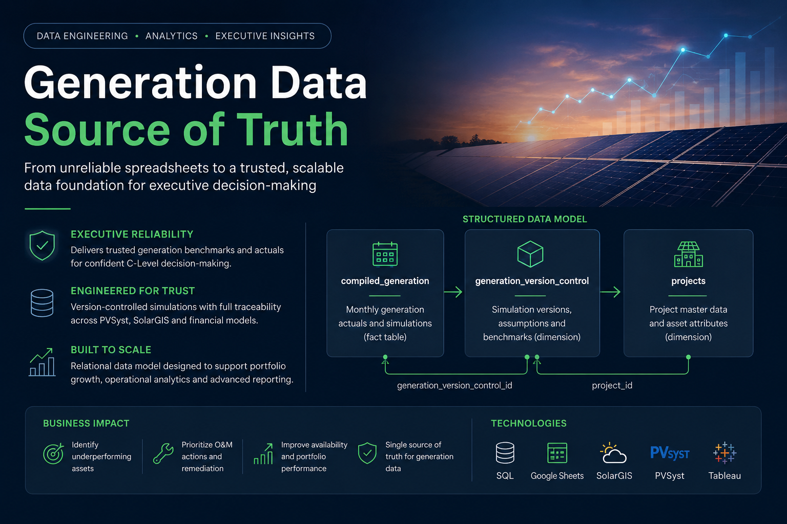
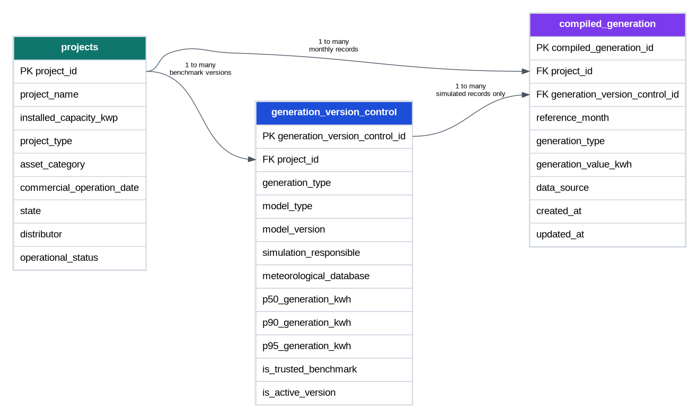
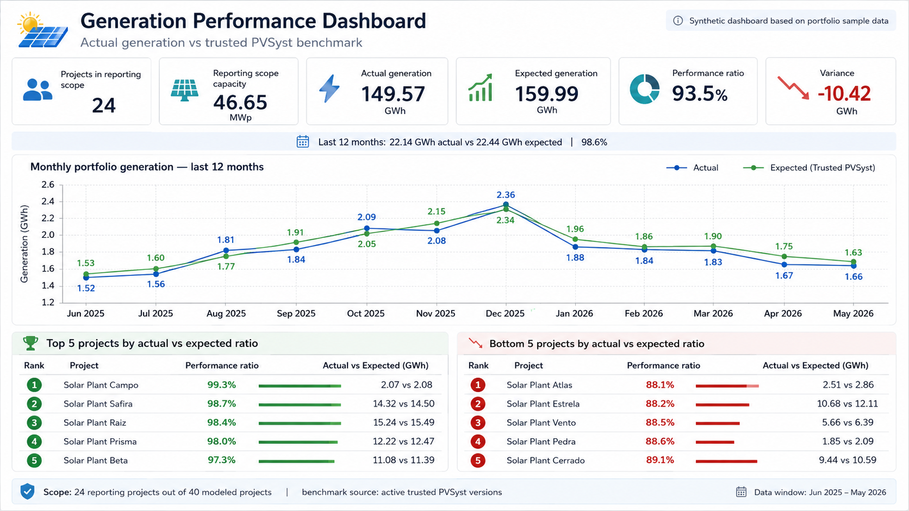
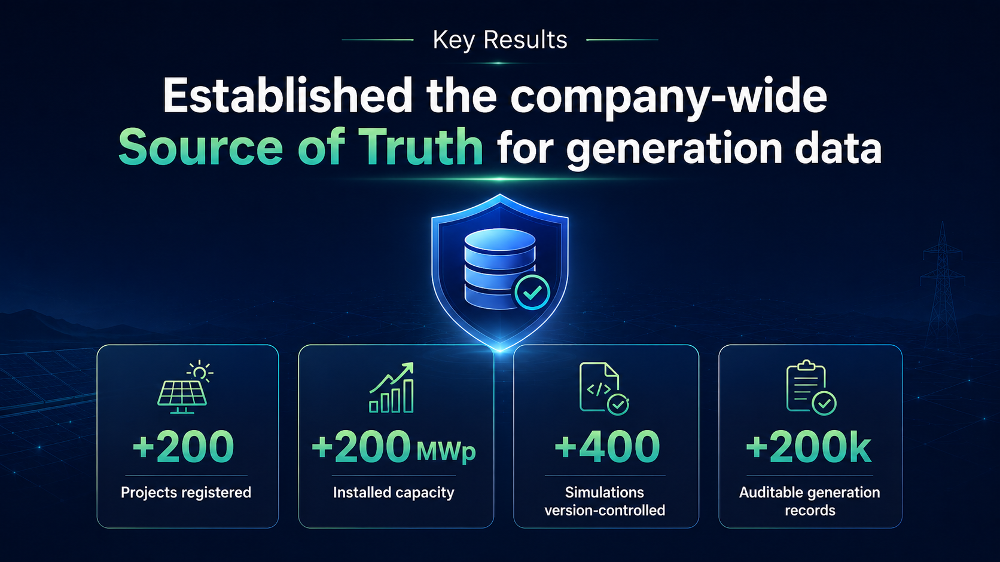

# Generation Data Source of Truth


## Overview

This project was developed after I was promoted to work more closely with the company’s C-Level, especially the COO. At that point, generation data had become one of the most important operational and strategic datasets in the company, but it was still being managed through a highly manual Google Sheets file.

The original spreadsheet combined monthly generation data from solar assets, simulation outputs from PVSyst and the financial model, and meteorological assumptions from SolarGIS. Although this file was treated as the final reference for generation values, it had several structural issues: poor optimization, limited scalability, weak version control, and no reliable way to identify which simulation should be considered the most recent or trustworthy for each asset.

After an incorrect data point was reported to the COO, the need for a more robust structure became clear. This project marked a turning point in my use of SQL and relational data modeling: I moved from spreadsheet-based analysis to a structured model designed for reliability, traceability, and executive reporting.

The final output was a set of three core tables that became the company’s source of truth for generation data and were later used to feed Tableau reports for executive and operational analysis.



---

## Business Context

The company needed a reliable way to compare actual solar generation against different simulation scenarios across its distributed generation portfolio.

Before this project, the process depended on a complex spreadsheet that attempted to consolidate several different data sources:

* Actual monthly generation from operating assets
* PVSyst simulation outputs
* Financial model generation assumptions
* SolarGIS meteorological data
* Project metadata and installed capacity information
* Different simulation versions for the same asset

The main challenge was not only consolidating the data, but also defining which simulation should be used as the reliable benchmark for each project.

In many cases, the same asset had more than one PVSyst study, more than one financial model assumption, or updated meteorological inputs. Without version control, the risk of reporting outdated or inconsistent values was high.

---

## Problem

The original process had several limitations:

* No formal version control for simulations
* Multiple PVSyst or financial model references for the same project
* Low traceability of simulation assumptions
* High risk of using outdated generation benchmarks
* Poor scalability as the asset portfolio grew
* Manual checks distributed across a poorly optimized spreadsheet
* Limited visibility into the reliability of each simulation source
* Difficulty comparing actual generation against trusted benchmarks

Because the spreadsheet was used as the final reference for generation values, any inconsistency could directly affect executive reporting, operational prioritization, and decision-making.

---

## Objective

The objective was to transform a fragile spreadsheet-based process into a structured analytical data model capable of:

* Consolidating monthly generation data
* Controlling simulation versions by project
* Identifying the most reliable generation benchmark available
* Connecting actual generation to PVSyst, financial model, and SolarGIS assumptions
* Supporting Tableau reports used by leadership
* Improving data reliability, scalability, and traceability
* Creating a single source of truth for generation analysis

---

## Data Model

The solution was structured around three main tables:

1. `compiled_generation`
2. `generation_version_control`
3. `projects`

Together, these tables created a simple but scalable model for generation analysis.

---

## Tables

### `compiled_generation`

Fact table used to store monthly generation values across actual and simulated generation scenarios.

**Granularity**: one row per project, reference month, generation type, and generation version when applicable.

This table was designed in a long-format structure, allowing actual generation and expected generation scenarios to be analyzed through the same analytical layer.

The table may include monthly values for:

* actual generation measured from operating assets;
* PVSyst monthly generation curves;
* SolarGIS-based expected generation;
* internally modeled or adjusted generation scenarios.

For simulated or benchmark scenarios, each monthly record can reference `generation_version_control`, which identifies the simulation version, source assumptions, and benchmark status behind that monthly value.

For actual generation, `generation_version_control_id` should generally be null, since actual measured generation is not itself a simulation or benchmark version.

---

### `generation_version_control`

Dimension table used to control simulation versions, benchmark assumptions, and the reliability status of expected generation scenarios.

This table does not store monthly generation curves. Instead, it stores metadata and control information about each benchmark version used for generation analysis.

It was designed to answer questions such as:

* Which simulation version should be used as the trusted benchmark for each project?
* Was the benchmark produced by the EPC, internal engineering team, construction team, or another source?
* Which meteorological database supported the simulation?
* Which financial model version was the simulation connected to?
* Is this version active, outdated, legacy, or replaced?
* Should this version be used for executive reporting?

Main purpose:

* Track PVSyst simulation versions
* Track financial model generation assumptions
* Store SolarGIS or other meteorological basis
* Control P50, P90, and P95 values derived from simulation outputs
* Identify the responsible source or team behind each benchmark
* Improve traceability of benchmark selection
* Support the selection of the most reliable expected-generation reference for each project

Example fields may include:

* Project ID
* Benchmark type: PVSyst, SolarGIS, Financial Modeled
* Model type: As-built, Legacy, EPC, Internal Engineering, etc.
* Model version
* Meteorological database
* Datasource or reference file
* P50 generation
* P90 generation
* P95 generation
* Is active version
* Is trusted benchmark

---

### `projects`

Dimension table containing project-level attributes.

This table provided the contextual information needed to analyze generation performance across different types of assets.

Main purpose:

* Store project metadata
* Connect generation data to asset characteristics
* Enable segmentation by project type, location, and installed capacity
* Support executive reporting and operational analysis

Example fields may include:

* Project ID
* Project name
* Installed capacity
* Project type
* Asset category
* Commercial operation date

---

## Entity Relationship Diagram



---

## Reporting Layer

The structured tables were used to feed Tableau reports focused on asset performance and generation reliability.

The reports compared actual generation against the most reliable simulation benchmarks available for each project.

Main analyses included:

* Actual generation vs trusted simulation scenarios
* Generation deviations by project
* Portfolio-level generation performance
* Identification of underperforming assets
* Comparison between expected and realized generation
* Operational prioritization for O&M actions
* Visibility into potential distributor-related issues
* Availability and performance remediation opportunities

Although the reports were mainly directed to the COO and had limited company-wide distribution, they played an important role in executive analysis and operational decision-making.



---

## Modeling Note - Monthly Curves vs Simulation Summary Values

The model separates monthly generation curves from simulation-level summary values.

The `compiled_generation` table stores monthly generation records. For PVSyst scenarios, this means it can contain the expected generation curve across the full useful life of the project, such as a 20-year monthly projection.

The `generation_version_control` table stores benchmark-level metadata and summary outputs. Values such as P50, P90, and P95 are not monthly records in this model. They represent simulation-level generation references derived from the probability distribution of the simulation output.

This separation was intentional:

* monthly records are used for time-series analysis, Tableau reporting, and actual vs expected comparisons;
* simulation summary values are used for benchmark governance, traceability, and confidence-level reference;
* multiple monthly curves can be connected to controlled benchmark versions;
* the company can compare realized monthly generation against the correct expected curve while still preserving the broader simulation assumptions behind that curve.

In practical terms, `compiled_generation` answers the operational question:

> How much generation was expected or realized in each month?

While `generation_version_control` answers the governance question:

> Which benchmark version does this expected generation come from, and should it be trusted?

---

## Business Impact

This project created a more reliable foundation for generation analysis across the company.

The main impact was not only the Tableau reporting layer, but the creation of a structured data model that became the source of truth for generation data.

Key results:

* Replaced a fragile spreadsheet process with a structured data model
* Created version control for generation simulations
* Improved traceability of PVSyst, financial model, and SolarGIS assumptions
* Reduced the risk of reporting outdated or incorrect generation benchmarks
* Enabled consistent actual vs expected generation analysis
* Supported executive decision-making for asset performance
* Helped identify projects with potential O&M, availability, or distributor-related issues
* Created a scalable structure for future portfolio growth



---

## Tools & Technologies

* SQL
* Google Sheets
* Tableau
* PVSyst
* SolarGIS
* Financial model data
* Relational data modeling
* Business analytics

---

## Project Outcomes

| Area                 | Outcome                                                                   |
| -------------------- | ------------------------------------------------------------------------- |
| Data Reliability     | Created a structured source of truth for generation data                  |
| Version Control      | Enabled tracking of multiple simulation versions by project               |
| Executive Reporting  | Supported Tableau reports used by the COO                                 |
| Operational Analysis | Helped identify underperforming assets and remediation priorities         |
| Scalability          | Replaced a manual spreadsheet logic with a more scalable data model       |
| Business Positioning | Strengthened the connection between analytics, leadership, and operations |

---

## What This Project Demonstrates

This project demonstrates my ability to:

* Translate an executive pain point into a structured data solution
* Learn and apply SQL to solve a real business problem
* Design analytical tables with clear business logic
* Build a source of truth for high-value operational data
* Connect technical implementation with decision-making needs
* Create visibility for asset performance and generation reliability
* Work across leadership, engineering, operations, and external data providers
* Improve processes under pressure after a reporting failure

---

## Repository Structure

```text
.
├── README.md
├── assets/
│   ├── dashboard.png
│   ├── generation_source_of_truth_erd.png
│   ├── header.png
│   ├── key_results.png
│   └── summary.png
├── data_dictionary/
│   ├── compiled_generation.md
│   ├── generation_version_control.md
│   └── projects.md
├── sample_tables/
│   ├── compiled_generation_sample.csv
│   ├── generation_version_control_sample.csv
│   └── projects_sample.csv
└── sql/
    └── 01_create_tables.sql
```

---

## Disclaimer

The data used in this repository is anonymized and simplified for portfolio purposes.

The original project was developed in a business environment where generation data had direct relevance for executive reporting, asset performance analysis, and operational decision-making.

---